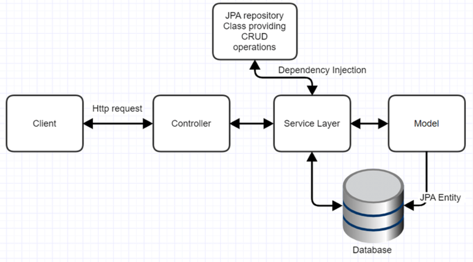

# Movie review DEMO using Spring boot, JPA, H2

-	Movie Review App is a Java implementation using Spring Boot that allows us to develop a stand-alone application.
-	This App makes user easier to retrieve movies according to his/ her selection criteria.
-	The app has main menu where list of movies are displayed based on Genre, Actor, Title, Year, Rating.
-	The Genre has submenus  like Action, Drama, Comedy, Horror, Sci-fi where user can also select option based on the submenu and know the relative information.
-	Postman will be used to test the rest services.

## Development 
| IDE Used | Build tool | Server | JDK | Spring Boot version | DB | Template Engine | 
| --- | --- | --- |--- |--- |--- |--- |
| IntelliJ | maven | Embedded Tomcat | 1.8 | 2.5.3 | H2 | Thymeleaf | 

    
## High level application architecture

