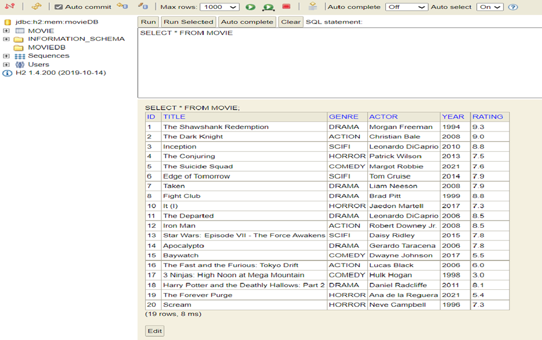

                                        
# MOVIE REVIEW APPLICATION

## DEVELOPMENT
|IDE Used |Build tool |Server | JDK |Spring Boot version | DB |Template Engine | 
| ---   | --- | --- |--- |--- |--- |--- |
|  IntelliJ  |  Maven |   Embedded Tomcat | 1.8 |  2.5.3 | H2 |   Thymeleaf |

## STATEMENT OF PURPOSE

- Movie Review App is a Java implementation using Spring Boot that allows us to develop a stand-alone application.
- This App makes user easier to retrieve movies according to his/ her selection criteria.
- The app has main menu where list of movies are displayed based on Genre, Actor, Title, Year, Rating, Add Movie, Delete Movie.
- The Genre has submenus  like Action, Drama, Comedy, Horror, Sci-fi where user can also select option based on the submenu and know the relative information.
- Postman will be used to test the rest services.

## BUSINESS PROBLEM
- The user might want to filter movies based on Genre, Title, Actor, Rating, Year if he wants to watch.
- Movie Review App helps you filter movies based on your selection.
- The user can add or delete a movie in his/ her list.

## TARGET AUDIENCE
- The user who want to keep track of movies based on filter criteria would love to use this app.
    
## HIGH LEVEL APPLICATION ARCHITECTURE

## LIST OF FEATURES IN MICROSERVICES
- Movie Review App is a Model View Controller implementation using Spring Boot that allows us to develop a stand-alone application.
- The view is created as a template using Thymeleaf.
- The Controller process the request by validating the input and retrieving appropriate data from database using SpringData JPA.
- Template Engine will render HTML view by processing the template with values set by controller.
- End result is HTML which has all the values resolved in the browser.

## IMPLEMENTATION PLAN THAT DETAILS STEPS AND TASKS REQUIRED TO IMPLEMENT MY MS
- Created a repository in GitHub named "MovieReview-Part B".
- Using Spring Initializer, I created a Spring Boot project with Maven dependencies a. Spring Web   b. H2 Database   c. Thymeleaf  d. JPA
- Added 2 entity classes with getters and setters defined "MovieDomain" which replicates movie table where we have id as primary key and "MovieModel" for WebApp Controller for Thymeleaf view both taking same parameters.
- @Entity- maps between Java class and table.
- @Id- maps table column id to Java attribute id which is autogenerated once we add a movie.
- @GenerateValue annotations that allowed me to indicate the unique ID field for the Entity and its value generated automatically when store in the H2 database.
- Added 2 Controllers: a. MovieController which maps HTTP request to repository and b. WebAppController which maps HTTP request to view templates and perform all processing in my web application.
- Mapping of the URI-s to my methods is done by @RequestMapping, @GetMapping, @PostMapping.In @RequestMapping I added @PathVariable which is use for data passed in the web services. And @RequestParam to extract the data found in the query parameters.
- Added MovieRepository which extends JpaRepository to retrieve appropriate data.
- Added data-h2.sql which has predefined values for H2 database. 
- Added schema-h2.sql which query for creating a table in database.
- Added MovieService are used to write business logic in a different layer.
- Added application.yml that contains the property for the application which helps the application to run in the different environment like H2, JPA.
- Added 2 HTML using Thymeleaf as view renderer.
- Added JUnit Tests for testing my application with service, rest service, JPA repository and H2 Database.

## FEATURES OF MS USING VARIETY OF JAVA AND SPRING PROGRAMMING CONCEPTS
### H2 Database
- A simple Movie Review Application which can demonstrate SpringBoot with SpringData JPA using H2 Database 
- Database in H2, structure movie tables has columns, schema definition for the H2 where I used an id(primary key) and the details of title, genre, actor, year, rating are stored.
- When I launch my application I have predefined data which is loaded in database which populates 20 movie details.
- We can filter by genre, title, actor, year, rating. Rating is filtered based on Min Max values and Year by decade.
- When I try to filter by (for e.g) genre and sub option- Drama , all the movies are listed
- When I select this I make MVC endpoints which can pass Genre as a parameter. In the WebAppController where I can call this endpoint Genre and then get details of the PathVariable.
- Then, I call the service method which retrieves the information. 

!

### Thymeleaf Engine
- I have 2 simple thymeleaf a. List of Movies  b.  Add movies
- I used thymeleaf templates where we list movies which filters, add or delete movies.
- We capture details and provide submit action which call POST method which created movie.
- When we view Home page, it lists out all the movies and then provides filtering options dynamically based on movie list.
- For eg, I find unique actors, then I set unique actors attribute which will be used in Thymeleaf template
- Then I set the mapping which we can use in Thymeleaf rendering so that when I can select that particular range, it will form URL to filter movies based on Year by decade.

### Controller Flow
- When I select e.g filter by Genre -> Drama, this is the GET endpoint. I get genre, then get movie list by Genre makes a call to JPA method I defined here which will take genre, find the movie by input of genre we selected.
- I stream it, convert domain class to model class, and collect it as a list.
- We get the movie genre, then list of movies we applied filter.
- Even if we Add a movie, that fields of the new movie added will show up in the Home page where we filter options.

### DomainModel
- This has WebApp Controller which has Spring MVC with Thymeleaf view.
- The Movie Controller is a rest service which can be demonstrated using Postman.
- The domain classes, we have movie Domain which replicates movie table where we have id as primary key.
- It is auto generated id when we create new movie, id will be automatically generated through h2 Database using incrementing primary key.
- The column is mapped to Java variable.
- @Entity- maps between Java class and table.
- @Id- maps table column id to Java attribute id which is autogenerated once we  add a movie.

### Repository
- JPA repository where we specify repository for movie domain.
- JPA repository has predefined methods which has most of CRUD operations. 
- These are custom methods where Spring will do the implementation during Spring startup.
- We just need to use column name and Spring automatically provide implementation and internally generates SQL queries dynamically.

### Service
- Service is used to write business logic in a different layer.
- All the business logic with methods to retrieve appropriate data is defined here.

### JUnit
- JUnit which uses a random port that will launch embedded H2 and embedded Tomcat.
- Using H2, here I am using rest template so that we use exchange method to invoke rest services directly and we can process it.
- Maps to a list of MovieModel
- Verify if responses are not null and if status is OK.
- Eg. For testAddMovies where we create model, we create request body where we can pass new movie.
- We call createMovie, we get the created movie response by calling POST method of movies.
- The id that we get as response is int, we validate the integer is not null, we use same integer to get movies, so that information we used to create movie, is validated.
- Movie is created dynamically calling the getMovie by generated id.
- This will validate whatever information we passed has been stored correctly in H2 by calling GET method.
- So, we are testing service, rest service, JPA repository and H2 everything using this test.

